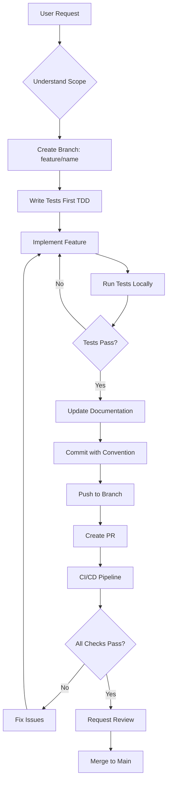
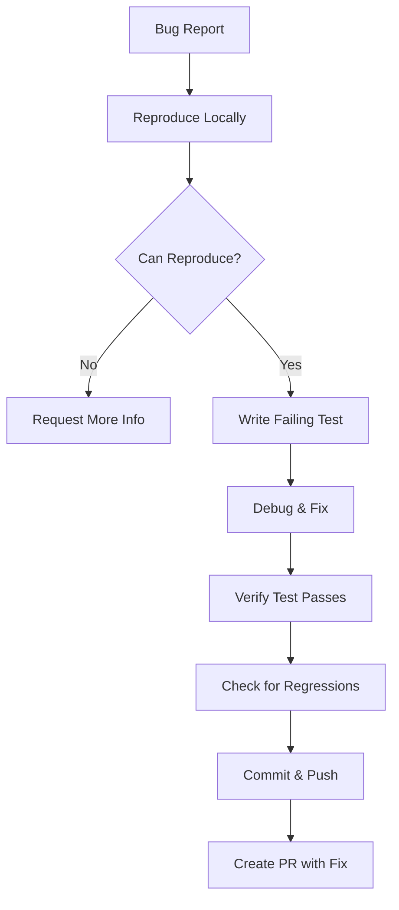
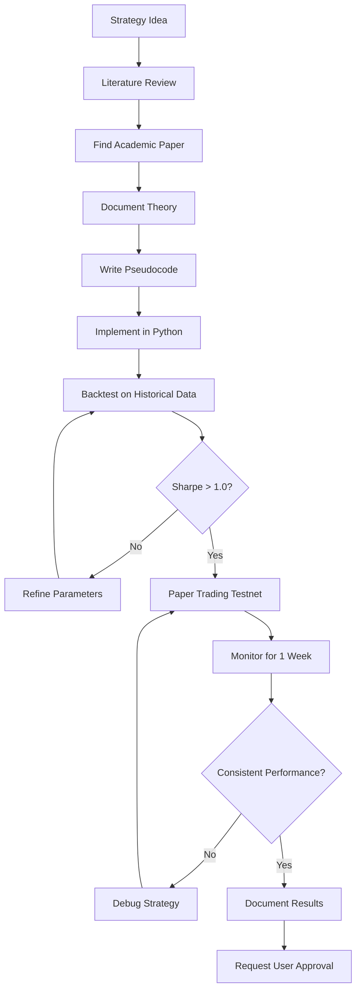
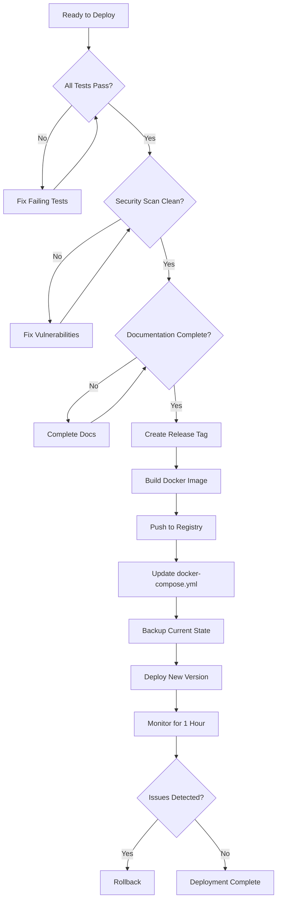

# CLAUDE.md - ShopGuard Crypto Trading Platform
# Directive, Orchestration, and Execution Framework

**Version**: 1.0.0
**Last Updated**: 2026-01-14
**Project**: ShopGuard - Hyperliquid DEX Crypto Trading Platform
**Branch**: claude/continue-work-gdSgP

---

## 🎯 PROJECT MISSION

Transform trading strategies into executable crypto trades on Hyperliquid DEX with:
- **Zero human intervention** for routine operations
- **Academic rigor** in strategy implementation
- **Production-grade** reliability and security
- **Full transparency** in decision-making

---

## 📋 TABLE OF CONTENTS

1. [Core Directives](#core-directives)
2. [Project Architecture](#project-architecture)
3. [Execution Workflows](#execution-workflows)
4. [Development Protocols](#development-protocols)
5. [Testing Framework](#testing-framework)
6. [Deployment Procedures](#deployment-procedures)
7. [Monitoring & Maintenance](#monitoring--maintenance)
8. [Emergency Protocols](#emergency-protocols)
9. [Decision Trees](#decision-trees)
10. [Code Standards](#code-standards)
11. [Knowledge Base](#knowledge-base)

---

## 🔥 CORE DIRECTIVES

### Prime Directive
**NEVER trade real money without explicit user confirmation**

### Secondary Directives
1. **Safety First**: Always default to testnet
2. **Test Everything**: No code goes to production untested
3. **Document Everything**: Every decision must be traceable
4. **Security Paranoia**: Treat all credentials as compromised by default
5. **Academic Integrity**: All strategies must cite research
6. **User Transparency**: Never hide what the system is doing

### Forbidden Actions
- ❌ NEVER commit private keys or API keys
- ❌ NEVER push to main branch without tests passing
- ❌ NEVER modify leverage without explicit user request
- ❌ NEVER disable safety checks in production
- ❌ NEVER trade on mainnet without user confirmation
- ❌ NEVER ignore test failures
- ❌ NEVER deploy without backup plan

---

## 🏗️ PROJECT ARCHITECTURE

### Layer 1: Core Infrastructure
```
src/
├── trading/hyperliquid_adapter.py    # DEX connection (608 lines)
├── api/strategy.py                   # Strategy framework
├── core/                             # Mathematical models
│   ├── models/                       # GARCH, regime switching
│   ├── signals/                      # Fourier, wavelets, Kalman
│   └── math/                         # Position sizing, Kelly
└── infrastructure/                   # Order management, risk
```

**Purpose**: Foundation for all trading operations
**Critical Files**: `hyperliquid_adapter.py`, `strategy.py`
**Dependencies**: numpy, pandas, hyperliquid-python-sdk

### Layer 2: Strategy Engine
```
strategies/
├── momentum.py              # Momentum + Dual Momentum
├── mean_reversion.py        # Mean Rev + Pairs Trading
├── ml_strategy.py           # ML Prediction + Ensemble
├── trend_following.py       # MA Cross + Breakout
└── statistical_arbitrage.py # Stat arb framework
```

**Purpose**: Convert market data into trading signals
**Critical Files**: All strategy files
**Dependencies**: Layer 1 + torch, scikit-learn

### Layer 3: Execution Layer
```
src/
├── execution/              # Smart routing, market impact
├── portfolio/              # Optimization, risk parity
├── monitoring/             # Dashboard, alerts, health
└── notifications/          # Email, SMS, Telegram
```

**Purpose**: Execute signals with optimal execution
**Critical Files**: `smart_router.py`, `notifier.py`
**Dependencies**: Layer 1 & 2 + twilio, sendgrid, telegram

### Layer 4: Data & Persistence
```
src/
├── datastore/              # Database schemas, pipelines
├── data_ingestion/         # Historical data providers
└── research/backtesting/   # Backtesting engine
```

**Purpose**: Store and retrieve all trading data
**Critical Files**: `historical.py`, `init_db.sql`
**Dependencies**: sqlalchemy, psycopg2, redis

### Layer 5: Interface Layer
```
├── api_server.py           # REST API (FastAPI)
├── webapp/app.py           # Web dashboard (Flask)
├── crypto_quick_start.py   # CLI interface
└── assistant.py            # Interactive assistant
```

**Purpose**: Human-machine interface
**Critical Files**: `api_server.py`, `crypto_quick_start.py`
**Dependencies**: fastapi, flask, uvicorn

---

## ⚙️ EXECUTION WORKFLOWS

### Workflow 1: New Feature Development



**Steps**:
1. **Understand**: Read user request completely, ask clarifying questions
2. **Branch**: Create feature branch: `git checkout -b feature/descriptive-name`
3. **TDD**: Write tests FIRST (`tests/unit/test_*.py`)
4. **Implement**: Write minimal code to pass tests
5. **Test**: Run `pytest -v` locally
6. **Document**: Update relevant .md files
7. **Commit**: Use conventional commits: `feat:`, `fix:`, `docs:`, etc.
8. **Push**: `git push origin feature/name`
9. **PR**: Create pull request with template
10. **CI/CD**: Wait for GitHub Actions
11. **Merge**: After approval and checks pass

**Example**:
```bash
# User wants: "Add stop-loss feature to Hyperliquid adapter"

# 1. Create branch
git checkout -b feature/add-stop-loss-hyperliquid

# 2. Write test first
# File: tests/unit/test_hyperliquid_stop_loss.py
def test_stop_loss_placement():
    hl = HyperliquidAdapter(testnet=True)
    hl.connect()

    # Place stop loss
    response = hl.place_stop_loss(
        coin="BTC",
        trigger_price=39000,
        size=0.01
    )

    assert response is not None
    assert response['status'] == 'success'

# 3. Implement feature
# File: src/trading/hyperliquid_adapter.py
def place_stop_loss(self, coin, trigger_price, size):
    # Implementation here
    pass

# 4. Test
pytest tests/unit/test_hyperliquid_stop_loss.py -v

# 5. Commit
git add .
git commit -m "feat: Add stop-loss order support to Hyperliquid adapter

- Implement place_stop_loss() method
- Add trigger price validation
- Add unit tests
- Update documentation"

# 6. Push and PR
git push origin feature/add-stop-loss-hyperliquid
```

---

### Workflow 2: Bug Fix



**Steps**:
1. **Reproduce**: Create minimal reproduction case
2. **Test**: Write test that fails with bug
3. **Fix**: Fix the bug
4. **Verify**: Ensure test now passes
5. **Regression**: Run full test suite
6. **Document**: Update CHANGELOG.md
7. **Commit**: Use `fix:` prefix

**Example**:
```bash
# Bug: "Positions not updating correctly"

# 1. Reproduce
python -c "
from trading.hyperliquid_adapter import HyperliquidAdapter
hl = HyperliquidAdapter(testnet=True)
hl.connect()
positions = hl.get_positions()
print(positions)  # Shows old data
"

# 2. Write failing test
def test_position_update_accuracy():
    hl = HyperliquidAdapter(testnet=True)
    hl.connect()

    # Place order
    hl.place_order(coin="BTC", is_buy=True, size=0.01, limit_price=40000)

    # Wait for fill
    time.sleep(2)

    # Get positions
    positions = hl.get_positions()

    # Should reflect new position
    btc_pos = next((p for p in positions if p.coin == "BTC"), None)
    assert btc_pos is not None
    assert btc_pos.size == 0.01

# 3. Fix the bug
# In hyperliquid_adapter.py, update cache invalidation logic

# 4. Verify
pytest tests/unit/test_position_update.py -v

# 5. Commit
git commit -m "fix: Correct position cache invalidation in Hyperliquid adapter

- Invalidate position cache after order fills
- Add test for position update accuracy
- Fixes #123"
```

---

### Workflow 3: Strategy Implementation



**Steps**:
1. **Research**: Find academic papers supporting strategy
2. **Document**: Write strategy theory in `strategies/README.md`
3. **Pseudocode**: Write clear pseudocode first
4. **Implement**: Create `strategies/new_strategy.py`
5. **Backtest**: Test on 2+ years of data
6. **Paper Trade**: Run on testnet for 1 week minimum
7. **Document**: Write complete usage guide
8. **Approval**: Get user sign-off before production

**Template**:
```python
"""
[Strategy Name] Trading Strategy

Academic Basis:
- [Author] ([Year]) "[Paper Title]"
- Key finding: [Summary]
- Sharpe ratio (historical): [Value]

Logic:
1. [Step 1]
2. [Step 2]
3. [Step 3]

Parameters:
- lookback_period: [default value]
- entry_threshold: [default value]
- exit_threshold: [default value]

Risk Management:
- Max position: [X%]
- Stop loss: [Y%]
- Max drawdown: [Z%]
"""

import sys
import os
sys.path.insert(0, os.path.join(os.path.dirname(__file__), '..', 'src'))

from api.strategy import Strategy, Signal, StrategyContext
from dataclasses import dataclass
from typing import List

@dataclass
class NewStrategyConfig(StrategyConfig):
    """Configuration for new strategy"""
    lookback_period: int = 20
    entry_threshold: float = 2.0
    exit_threshold: float = 0.5

class NewStrategy(Strategy):
    """
    [Strategy Name]

    [Brief description]
    """

    def __init__(self, config: NewStrategyConfig):
        super().__init__(config)
        self.config = config
        # Initialize strategy-specific state

    def on_start(self):
        """Initialize strategy"""
        self.log(f"{self.config.name} started")
        # Setup logic

    def on_data(self, context: StrategyContext) -> List[Signal]:
        """Generate trading signals"""
        signals = []

        # Strategy logic here
        # 1. Analyze market data
        # 2. Calculate indicators
        # 3. Generate signals

        return signals

    def on_stop(self):
        """Cleanup when strategy stops"""
        self.log(f"{self.config.name} stopped")
```

---

### Workflow 4: Deploy to Production



**Checklist**:
- [ ] All tests passing (unit, integration, e2e)
- [ ] Code coverage > 80%
- [ ] Security scan clean (bandit, safety)
- [ ] Documentation updated
- [ ] CHANGELOG.md updated
- [ ] Version bumped (semantic versioning)
- [ ] Backup created
- [ ] Rollback plan ready
- [ ] Monitoring alerts configured
- [ ] User notified of deployment

**Commands**:
```bash
# 1. Pre-deployment checks
pytest --cov=src --cov-report=term-missing
bandit -r src/
safety check

# 2. Create release
git tag -a v1.2.3 -m "Release v1.2.3: Add stop-loss support"
git push origin v1.2.3

# 3. Build Docker image
docker build -t shopguard:v1.2.3 .
docker tag shopguard:v1.2.3 ghcr.io/username/shopguard:v1.2.3
docker push ghcr.io/username/shopguard:v1.2.3

# 4. Backup current deployment
docker-compose exec postgres pg_dump -U trader quant_research > backup_$(date +%Y%m%d).sql

# 5. Deploy
docker-compose pull
docker-compose up -d

# 6. Monitor
docker-compose logs -f --tail=100

# 7. Health check
curl http://localhost:8000/health
```

---

## 🧪 TESTING FRAMEWORK

### Test Pyramid

```
           /\
          /  \         E2E Tests (10%)
         /    \        - Full workflows
        /------\       - Real integrations
       /        \
      /  INTEG   \     Integration Tests (20%)
     /            \    - Component interactions
    /--------------\   - Database + Redis
   /                \
  /    UNIT TESTS    \ Unit Tests (70%)
 /                    \ - Individual functions
/______________________\ - Mocked dependencies
```

### Test Types

#### 1. Unit Tests (70% of tests)
**Location**: `tests/unit/`
**Purpose**: Test individual functions in isolation
**Run**: `pytest tests/unit/ -v`

**Example**:
```python
# tests/unit/test_hyperliquid_adapter.py
import pytest
from trading.hyperliquid_adapter import HyperliquidAdapter

@pytest.mark.unit
@pytest.mark.fast
def test_market_price_parsing():
    """Test market price parsing logic"""
    hl = HyperliquidAdapter(testnet=True)

    # Mock response
    mock_data = {'BTC': 40000.0, 'ETH': 2500.0}

    # Test parsing
    btc_price = mock_data.get('BTC')
    assert btc_price == 40000.0
    assert isinstance(btc_price, float)

@pytest.mark.unit
def test_position_calculation():
    """Test position size calculation"""
    hl = HyperliquidAdapter(testnet=True)

    # Test leverage calculation
    size = 0.1
    leverage = 5
    margin_required = size / leverage

    assert margin_required == 0.02
```

**Guidelines**:
- Test one thing per test
- Use descriptive test names
- Mock external dependencies
- Fast execution (< 1 second per test)
- No network calls
- No database access

#### 2. Integration Tests (20% of tests)
**Location**: `tests/integration/`
**Purpose**: Test component interactions
**Run**: `pytest tests/integration/ -v`

**Example**:
```python
# tests/integration/test_strategy_execution.py
import pytest
from strategies import MomentumStrategy
from trading.hyperliquid_adapter import HyperliquidAdapter
from api.strategy import StrategyConfig

@pytest.mark.integration
@pytest.mark.slow
def test_strategy_with_live_adapter():
    """Test strategy generates signals with real adapter"""
    # Setup
    config = StrategyConfig(
        name="TestMomentum",
        symbols=['BTC', 'ETH'],
        parameters={'lookback_period': 5}
    )

    strategy = MomentumStrategy(config)
    hl = HyperliquidAdapter(testnet=True)
    hl.connect()

    # Get market data
    context = strategy.create_context_from_adapter(hl)

    # Generate signals
    signals = strategy.on_data(context)

    # Verify
    assert isinstance(signals, list)
    for signal in signals:
        assert signal.symbol in ['BTC', 'ETH']
        assert -1.0 <= signal.direction <= 1.0
```

**Guidelines**:
- Test component boundaries
- Use real databases (in docker)
- Allow network calls to testnet
- Slower execution (< 10 seconds)
- Clean up state after tests

#### 3. E2E Tests (10% of tests)
**Location**: `tests/e2e/`
**Purpose**: Test complete workflows
**Run**: `pytest tests/e2e/ -v --slow`

**Example**:
```python
# tests/e2e/test_full_trading_workflow.py
import pytest
import time
from trading.hyperliquid_adapter import HyperliquidAdapter
from strategies import MomentumStrategy
from notifications import send_trade_notification

@pytest.mark.e2e
@pytest.mark.slow
@pytest.mark.requires_api
def test_complete_trade_lifecycle():
    """
    Test complete trading workflow:
    1. Connect to Hyperliquid
    2. Strategy generates signal
    3. Place order
    4. Monitor for fill
    5. Close position
    6. Send notification
    """
    # 1. Connect
    hl = HyperliquidAdapter(testnet=True)
    assert hl.connect()

    # 2. Get initial state
    initial_balance = hl.get_balances()
    assert initial_balance['USDC'] > 0

    # 3. Place order
    order = hl.place_order(
        coin="BTC",
        is_buy=True,
        size=0.01,
        limit_price=30000  # Low price, won't fill immediately
    )
    assert order is not None

    # 4. Check order exists
    open_orders = hl.get_open_orders()
    assert len(open_orders) > 0

    # 5. Cancel order
    hl.cancel_all_orders()

    # 6. Verify cancelled
    open_orders = hl.get_open_orders()
    assert len(open_orders) == 0

    # 7. Verify balance unchanged
    final_balance = hl.get_balances()
    assert final_balance['USDC'] == initial_balance['USDC']
```

**Guidelines**:
- Test realistic user scenarios
- Use testnet only
- Allow longer execution (< 60 seconds)
- Clean up all state
- Mark as `@pytest.mark.requires_api`

### Test Markers

```python
# Fast tests (< 1s)
@pytest.mark.fast

# Slow tests (> 5s)
@pytest.mark.slow

# Unit tests
@pytest.mark.unit

# Integration tests
@pytest.mark.integration

# E2E tests
@pytest.mark.e2e

# Requires API keys
@pytest.mark.requires_api

# Tests specific components
@pytest.mark.models      # Mathematical models
@pytest.mark.ai          # AI/ML models
@pytest.mark.execution   # Execution layer
@pytest.mark.risk        # Risk management
@pytest.mark.data        # Data pipelines
```

**Usage**:
```bash
# Run only fast tests
pytest -m fast

# Run all except slow tests
pytest -m "not slow"

# Run unit tests only
pytest -m unit

# Run with coverage
pytest --cov=src --cov-report=html
```

---

## 🚀 DEPLOYMENT PROCEDURES

### Environment Types

#### 1. Development (Local)
**Purpose**: Active development and debugging
**Configuration**:
```bash
ENVIRONMENT=development
HYPERLIQUID_TESTNET=true
DEBUG=true
LOG_LEVEL=DEBUG
```

**Setup**:
```bash
# Install dev dependencies
pip install -r requirements.txt
pip install -r requirements-dev.txt

# Run locally
python crypto_quick_start.py
python api_server.py --reload
```

#### 2. Staging (Docker Testnet)
**Purpose**: Pre-production testing
**Configuration**:
```bash
ENVIRONMENT=staging
HYPERLIQUID_TESTNET=true
DEBUG=false
LOG_LEVEL=INFO
```

**Setup**:
```bash
# Start staging environment
docker-compose -f docker-compose.staging.yml up -d

# Run smoke tests
pytest tests/e2e/ -v

# Monitor
docker-compose logs -f
```

#### 3. Production (Docker Mainnet)
**Purpose**: Live trading with real funds
**Configuration**:
```bash
ENVIRONMENT=production
HYPERLIQUID_TESTNET=false
DEBUG=false
LOG_LEVEL=WARNING
ENABLE_TRADING=false  # Manual enable required
```

**Setup**:
```bash
# CRITICAL: Verify configuration
cat .env | grep HYPERLIQUID_TESTNET
# Must show: HYPERLIQUID_TESTNET=false

# Create backup
./scripts/backup.sh

# Deploy
docker-compose -f docker-compose.prod.yml up -d

# Monitor for 1 hour
watch -n 60 'curl http://localhost:8000/health'

# Enable trading (after verification)
# Requires manual user approval
```

### Deployment Checklist

**Pre-Deployment**:
- [ ] All tests passing (`pytest`)
- [ ] Security scan clean (`bandit -r src/`)
- [ ] Dependencies updated (`safety check`)
- [ ] Documentation updated
- [ ] Version bumped in `__version__`
- [ ] CHANGELOG.md updated
- [ ] .env.production configured
- [ ] Backup created
- [ ] Rollback plan documented

**During Deployment**:
- [ ] Stop current services gracefully
- [ ] Backup database (`pg_dump`)
- [ ] Pull latest code/images
- [ ] Apply database migrations
- [ ] Start new services
- [ ] Verify health checks
- [ ] Check logs for errors
- [ ] Verify connectivity to Hyperliquid

**Post-Deployment**:
- [ ] Monitor for 1 hour minimum
- [ ] Check error rates
- [ ] Verify trades executing correctly
- [ ] Confirm notifications working
- [ ] Update monitoring dashboards
- [ ] Document any issues
- [ ] Notify stakeholders

### Rollback Procedure

```bash
# EMERGENCY ROLLBACK

# 1. Stop current deployment
docker-compose down

# 2. Restore previous version
docker-compose -f docker-compose.prod.yml.backup up -d

# 3. Restore database (if needed)
docker-compose exec postgres psql -U trader quant_research < backup_latest.sql

# 4. Verify rollback
curl http://localhost:8000/health

# 5. Cancel all open orders
python -c "
from trading.hyperliquid_adapter import HyperliquidAdapter
hl = HyperliquidAdapter(testnet=False)
hl.connect()
hl.cancel_all_orders()
print('All orders cancelled')
"

# 6. Notify team
python -c "
from notifications import send_system_alert
send_system_alert('Rollback Complete', 'System rolled back to previous version')
"
```

---

## 📊 MONITORING & MAINTENANCE

### Key Metrics to Monitor

#### 1. System Health
```python
# Monitor every 60 seconds
{
    "status": "healthy",
    "timestamp": "2026-01-14T12:00:00Z",
    "uptime_seconds": 3600,
    "version": "1.2.3",
    "hyperliquid_connected": true,
    "database_connected": true,
    "redis_connected": true
}
```

**Alerts**:
- System down for > 5 minutes
- Hyperliquid disconnected for > 2 minutes
- Database errors

#### 2. Trading Metrics
```python
# Monitor every 5 minutes
{
    "active_positions": 3,
    "open_orders": 5,
    "daily_pnl": 150.25,
    "daily_pnl_pct": 1.5,
    "total_trades_today": 12,
    "win_rate_today": 0.67,
    "current_leverage": 3.2,
    "margin_usage_pct": 45.0
}
```

**Alerts**:
- Daily loss > 2%
- Leverage > 10x
- Margin usage > 80%
- Open orders > 20

#### 3. Risk Metrics
```python
# Monitor every 1 minute
{
    "max_position_size": 0.15,
    "current_drawdown": -0.03,
    "max_drawdown": -0.08,
    "var_95": -1500.0,
    "sharpe_ratio": 1.8,
    "volatility": 0.15
}
```

**Alerts**:
- Drawdown > 10%
- VaR breached
- Sharpe ratio < 0.5 for 7 days

#### 4. Performance Metrics
```python
# Monitor every hour
{
    "total_return": 0.125,
    "sharpe_ratio": 1.8,
    "max_drawdown": -0.08,
    "win_rate": 0.58,
    "profit_factor": 1.6,
    "total_trades": 234,
    "avg_trade_duration": "4h 32m"
}
```

### Monitoring Dashboard

**Grafana Panels**:
1. **Portfolio Value** (time series)
2. **Daily P&L** (bar chart)
3. **Open Positions** (table)
4. **Risk Metrics** (gauge)
5. **System Health** (status)
6. **Error Rate** (time series)

**Access**: http://localhost:3000 (with monitoring profile)

### Log Aggregation

**Structure**:
```
logs/
├── trading.log        # All trading activity
├── risk.log          # Risk events and alerts
├── system.log        # System events
├── errors.log        # Errors only
└── audit.log         # Audit trail
```

**Format**:
```
2026-01-14 12:00:00.123 [INFO] trading: Order placed: BTC BUY 0.01 @ 40000
2026-01-14 12:00:01.456 [WARNING] risk: Margin usage high: 85%
2026-01-14 12:00:02.789 [ERROR] system: API connection timeout
```

**Monitoring Commands**:
```bash
# Follow trading log
tail -f logs/trading.log

# Watch for errors
tail -f logs/errors.log

# Search for specific events
grep "Order filled" logs/trading.log

# Count errors in last hour
grep "ERROR" logs/errors.log | tail -100 | wc -l
```

### Maintenance Tasks

#### Daily
- [ ] Check error logs
- [ ] Verify system health
- [ ] Review trading performance
- [ ] Check funding rates
- [ ] Verify backups ran

#### Weekly
- [ ] Review strategy performance
- [ ] Analyze risk metrics
- [ ] Update dependencies (`dependabot`)
- [ ] Review and archive logs
- [ ] Test rollback procedure

#### Monthly
- [ ] Full system audit
- [ ] Performance review
- [ ] Strategy optimization
- [ ] Security review
- [ ] Disaster recovery test

---

## 🚨 EMERGENCY PROTOCOLS

### P0: Critical - Trading Malfunction

**Symptoms**:
- Uncontrolled position opening
- Leverage exceeding limits
- Unauthorized trades
- API key compromise suspected

**Immediate Actions** (< 60 seconds):
```bash
# 1. EMERGENCY STOP - Kill switch
python emergency_stop.py

# 2. Cancel all orders
python -c "
from trading.hyperliquid_adapter import HyperliquidAdapter
hl = HyperliquidAdapter(testnet=False)
hl.connect()
hl.cancel_all_orders()
print('✓ All orders cancelled')
"

# 3. Close all positions (if safe)
python -c "
from trading.hyperliquid_adapter import HyperliquidAdapter
hl = HyperliquidAdapter(testnet=False)
hl.connect()
for pos in hl.get_positions():
    hl.close_position(pos.coin)
    print(f'✓ Closed {pos.coin}')
"

# 4. Disable API wallet (if compromised)
# Go to app.hyperliquid.xyz → Settings → API → Revoke

# 5. Stop all services
docker-compose down

# 6. Notify team
python -c "
from notifications import send_system_alert
send_system_alert('🚨 EMERGENCY STOP', 'Trading halted. All positions closed.')
"
```

**Post-Incident**:
1. Investigate root cause
2. Document in incident report
3. Implement fixes
4. Test thoroughly
5. Resume trading only after approval

### P1: High - System Degradation

**Symptoms**:
- High error rate (> 10%)
- Slow response times (> 5s)
- Partial service failure
- Data inconsistencies

**Actions** (< 5 minutes):
```bash
# 1. Identify failing component
docker-compose ps
docker-compose logs --tail=100 | grep ERROR

# 2. Restart affected service
docker-compose restart trading-app

# 3. Monitor recovery
watch -n 10 'curl http://localhost:8000/health'

# 4. If not recovered in 5 min, rollback
./rollback.sh

# 5. Notify
python -c "
from notifications import send_system_alert
send_system_alert('⚠️ System Degraded', 'Service restarted. Monitoring.')
"
```

### P2: Medium - Performance Issue

**Symptoms**:
- Slower than usual execution
- Increased latency
- Higher costs
- Strategy underperformance

**Actions** (< 30 minutes):
```bash
# 1. Collect diagnostics
python diagnose.py > diagnostics_$(date +%Y%m%d_%H%M%S).txt

# 2. Check system resources
docker stats

# 3. Review logs
grep "SLOW\|TIMEOUT" logs/system.log

# 4. Optimize or scale
docker-compose scale trading-app=2

# 5. Document findings
```

### P3: Low - Minor Issue

**Symptoms**:
- Sporadic errors
- Non-critical warnings
- UI glitches
- Documentation gaps

**Actions** (< 1 day):
```bash
# 1. Create issue
gh issue create --title "Bug: ..." --label bug

# 2. Add to backlog
# 3. Fix in next sprint
```

---

## 🤔 DECISION TREES

### Decision Tree 1: Which Strategy to Use?

```
Start: User wants to implement a strategy

Q1: What's the market condition?
├─ Trending strongly → Momentum Strategy
├─ Range-bound → Mean Reversion Strategy
├─ High volatility → Breakout Strategy
└─ Uncertain → Go to Q2

Q2: What's the user's risk tolerance?
├─ Low → Pairs Trading (market neutral)
├─ Medium → Trend Following
└─ High → ML Prediction Strategy

Q3: What's the time horizon?
├─ < 1 day → Scalping (not implemented yet)
├─ 1-7 days → Momentum or Breakout
├─ 1-4 weeks → Dual Momentum
└─ > 1 month → ML Ensemble Strategy

Q4: What's the capital allocation?
├─ < $1,000 → Single strategy, low leverage
├─ $1,000-$10,000 → 2-3 strategies, diversified
└─ > $10,000 → Full portfolio, risk parity

Final: Recommend strategy with parameters
```

### Decision Tree 2: Order Execution

```
Start: Strategy generates signal

Q1: Signal strength?
├─ < 0.3 → Ignore (too weak)
├─ 0.3-0.7 → Go to Q2
└─ > 0.7 → Use market order

Q2: How urgent?
├─ Very urgent → Market order with slippage protection
├─ Moderate → Aggressive limit order (0.1% from market)
└─ Patient → Limit order at signal price

Q3: Position size?
├─ Calculate: kelly_fraction * volatility_adj * confidence
├─ Check against max_position_pct
└─ Apply leverage limits

Q4: Risk checks?
├─ Check margin available
├─ Check position limits
├─ Check daily loss limit
└─ All pass? → Execute

Q5: Post-execution?
├─ Log trade
├─ Send notification
├─ Update dashboard
└─ Monitor for fill
```

### Decision Tree 3: Error Handling

```
Start: Error occurs

Q1: Error type?
├─ API Connection → Go to Q2
├─ Order Rejected → Go to Q3
├─ System Error → Go to Q4
└─ Strategy Error → Go to Q5

Q2: API Connection Error
├─ Retry 3 times with backoff
├─ If still fails:
│   ├─ Switch to backup connection
│   └─ If no backup: Alert and pause trading

Q3: Order Rejected
├─ Insufficient margin? → Reduce position size
├─ Invalid price? → Adjust limit price
├─ Duplicate order? → Check and cancel
└─ Other? → Log and alert

Q4: System Error
├─ Out of memory? → Restart service
├─ Database error? → Check connection, restore backup
├─ Unknown? → Enter safe mode, alert team

Q5: Strategy Error
├─ Data issue? → Skip this cycle
├─ Logic bug? → Disable strategy, alert
└─ Parameter issue? → Reset to defaults
```

---

## 📐 CODE STANDARDS

### Python Style Guide

**Follow PEP 8 with these additions**:

```python
# ✅ GOOD
def calculate_position_size(
    capital: float,
    risk_pct: float,
    volatility: float
) -> float:
    """
    Calculate position size using Kelly criterion.

    Args:
        capital: Available capital in USDC
        risk_pct: Risk per trade (0.01 = 1%)
        volatility: Asset volatility (annualized)

    Returns:
        Position size in USDC

    Example:
        >>> calculate_position_size(10000, 0.02, 0.15)
        1333.33
    """
    risk_amount = capital * risk_pct
    position_size = risk_amount / volatility
    return position_size


# ❌ BAD
def calc_pos(c, r, v):
    return c * r / v
```

### Naming Conventions

```python
# Classes: PascalCase
class MomentumStrategy:
    pass

# Functions: snake_case
def calculate_momentum():
    pass

# Constants: UPPER_SNAKE_CASE
MAX_POSITION_SIZE = 0.20

# Private methods: _prefix
def _internal_calculation():
    pass

# Variables: snake_case
current_price = 40000
is_long_position = True
```

### Documentation Standards

**Every module must have**:
```python
"""
Module Name

Brief description of what this module does.

Key components:
- Component1: Description
- Component2: Description

Usage:
    from module import Component1
    comp = Component1()
    comp.do_something()

References:
    - Paper citation if applicable
"""
```

**Every class must have**:
```python
class ClassName:
    """
    One-line summary.

    Detailed description of the class purpose and behavior.

    Attributes:
        attr1 (type): Description
        attr2 (type): Description

    Example:
        >>> obj = ClassName()
        >>> obj.method()
        'result'
    """
```

**Every public function must have**:
```python
def function_name(param1: type, param2: type) -> return_type:
    """
    One-line summary.

    Longer description if needed.

    Args:
        param1: Description
        param2: Description

    Returns:
        Description of return value

    Raises:
        ErrorType: When this happens

    Example:
        >>> function_name(1, 2)
        3
    """
```

### Commit Message Format

**Use Conventional Commits**:

```
<type>(<scope>): <subject>

<body>

<footer>
```

**Types**:
- `feat`: New feature
- `fix`: Bug fix
- `docs`: Documentation only
- `style`: Code style (formatting, no logic change)
- `refactor`: Code refactoring
- `test`: Adding tests
- `chore`: Maintenance tasks

**Examples**:
```bash
# Good
feat(hyperliquid): Add stop-loss order support

- Implement place_stop_loss() method
- Add trigger price validation
- Add unit tests for stop-loss
- Update API documentation

Closes #123

# Good
fix(portfolio): Correct position size calculation

Position sizes were being calculated with wrong leverage
multiplier. Now uses correct formula from Kelly criterion.

Fixes #456

# Bad
fixed stuff

# Bad
updated files
```

### Error Handling

```python
# ✅ GOOD: Specific exceptions, meaningful messages
from loguru import logger

def place_order(symbol: str, size: float, price: float):
    """Place order with comprehensive error handling."""
    try:
        # Validate inputs
        if size <= 0:
            raise ValueError(f"Invalid size: {size}. Must be positive.")

        if price <= 0:
            raise ValueError(f"Invalid price: {price}. Must be positive.")

        # Place order
        response = self.exchange.place_order(symbol, size, price)

        # Check response
        if not response:
            raise RuntimeError("Empty response from exchange")

        if response.get('status') == 'rejected':
            reason = response.get('reason', 'Unknown')
            raise OrderRejectedError(f"Order rejected: {reason}")

        logger.info(f"Order placed: {symbol} {size} @ {price}")
        return response

    except ValueError as e:
        logger.error(f"Validation error: {e}")
        raise

    except ConnectionError as e:
        logger.error(f"Connection error: {e}")
        # Try reconnect
        self.reconnect()
        raise

    except Exception as e:
        logger.error(f"Unexpected error placing order: {e}")
        raise


# ❌ BAD: Generic exceptions, no logging
def place_order(symbol, size, price):
    try:
        response = self.exchange.place_order(symbol, size, price)
        return response
    except:
        pass  # Silent failure
```

---

## 📚 KNOWLEDGE BASE

### Hyperliquid DEX

**Key Facts**:
- Decentralized perpetual futures exchange
- On-chain settlement on L1 blockchain
- No KYC required
- Leverage: 1-50x (cross or isolated margin)
- Funding: Every 8 hours
- Assets: 100+ crypto perpetuals

**Order Types**:
1. **Limit**: Standard limit order
2. **Market**: Converted to aggressive limit (no true market orders)
3. **Stop-Market**: Triggered at stop price
4. **Stop-Limit**: Triggered at stop, executes at limit
5. **TWAP**: Time-weighted average price (slice large orders)

**API Wallet**:
- Cannot withdraw funds
- Can trade and manage positions
- Revocable instantly
- Recommended for bots

**Funding Rates**:
- Positive: Longs pay shorts
- Negative: Shorts pay longs
- Paid every 8 hours
- Displayed as % per 8h

### Strategy Academic References

1. **Momentum**
   - Jegadeesh & Titman (1993) "Returns to Buying Winners and Selling Losers"
   - Key finding: 12-month momentum, 1-month reversal
   - Hold period: 3-12 months optimal

2. **Dual Momentum**
   - Antonacci (2014) "Dual Momentum Investing"
   - Combines absolute (trend) and relative (cross-sectional)
   - Sharpe ratio: 0.8-1.2 historical

3. **Mean Reversion**
   - Poterba & Summers (1988) "Mean Reversion in Stock Returns"
   - Short-term overreactions revert
   - Works best in range-bound markets

4. **Pairs Trading**
   - Gatev, Goetzmann & Rouwenhorst (2006)
   - Market-neutral, low correlation to market
   - Cointegration-based selection

5. **Trend Following**
   - Faber (2007) "A Quantitative Approach to Tactical Asset Allocation"
   - 10-month moving average
   - Simple but robust

### Risk Management Formulas

**Kelly Criterion**:
```python
f = (p * (b + 1) - 1) / b

where:
f = fraction of capital to bet
p = probability of winning
b = win/loss ratio

# For trading:
position_size = kelly_fraction * capital * (1/4)  # Fractional Kelly
```

**Position Sizing**:
```python
# Fixed fraction
position = capital * fixed_fraction

# Volatility adjusted
position = capital * (target_vol / current_vol)

# Risk-based
position = (capital * risk_pct) / stop_loss_pct
```

**Sharpe Ratio**:
```python
sharpe = (mean_return - risk_free_rate) / std_return * sqrt(252)

# Good: > 1.0
# Excellent: > 2.0
# Exceptional: > 3.0
```

**Maximum Drawdown**:
```python
drawdown = (peak_value - current_value) / peak_value

# Acceptable: < 10%
# Warning: > 15%
# Critical: > 20%
```

### Common Issues & Solutions

**Issue**: "Order rejected - insufficient margin"
**Solution**:
```python
# Check margin before order
state = hl.get_account_state()
available_margin = state['marginSummary']['withdrawable']

# Calculate required margin
required_margin = (size * price) / leverage

if required_margin > available_margin:
    # Reduce size or increase leverage
    size = available_margin * leverage / price
```

**Issue**: "Position not updating"
**Solution**:
```python
# Invalidate cache after orders
hl._position_cache_timestamp = 0

# Or force refresh
positions = hl.get_positions(force_refresh=True)
```

**Issue**: "Funding rate too high"
**Solution**:
```python
# Check before holding overnight
funding = hl.get_funding_rate("BTC")

# If too expensive (> 0.01 = 1% per 8h)
if abs(funding) > 0.01:
    # Consider closing or switching side
    hl.close_position("BTC")
```

---

## 🔄 CONTINUOUS IMPROVEMENT

### Weekly Review

**Every Monday**:
1. Review previous week's performance
2. Analyze winning and losing trades
3. Check strategy Sharpe ratios
4. Review error logs
5. Update this document

### Monthly Optimization

**First Monday of month**:
1. Backtest strategies on recent data
2. Adjust parameters if needed
3. Add new strategies if researched
4. Review and update documentation
5. Security audit

### Quarterly Goals

**Q1 2026**:
- [ ] Achieve 90%+ test coverage
- [ ] Deploy to production with $10k capital
- [ ] Implement 2 new strategies
- [ ] Add WebSocket real-time updates

**Q2 2026**:
- [ ] Scale to $50k capital
- [ ] Add more asset classes
- [ ] Implement advanced risk models
- [ ] Build ML prediction models

---

## 📝 CHANGELOG

### v1.0.0 (2026-01-14)
- Initial CLAUDE.md creation
- Complete D.O.E framework
- All workflows documented
- Testing framework defined
- Emergency protocols established

---

## 🎓 LEARNING RESOURCES

### Must-Read Papers
1. Jegadeesh & Titman (1993) - Momentum
2. Antonacci (2014) - Dual Momentum
3. Faber (2007) - Trend Following
4. Gatev et al. (2006) - Pairs Trading
5. Marcos Lopez de Prado (2018) - Advances in Financial ML

### Technical Documentation
- Hyperliquid Docs: https://hyperliquid.gitbook.io
- FastAPI Docs: https://fastapi.tiangolo.com
- Docker Docs: https://docs.docker.com
- Pytest Docs: https://docs.pytest.org

### Development Tools
- GitHub Actions: https://docs.github.com/actions
- Docker Compose: https://docs.docker.com/compose/
- PostgreSQL: https://www.postgresql.org/docs/
- TimescaleDB: https://docs.timescale.com/

---

## 🤝 COLLABORATION GUIDELINES

### When Working with Users

**Always**:
- ✅ Ask clarifying questions upfront
- ✅ Explain your reasoning
- ✅ Show code examples
- ✅ Document assumptions
- ✅ Request approval for risky operations
- ✅ Commit frequently with clear messages

**Never**:
- ❌ Assume what user wants
- ❌ Skip testing
- ❌ Commit without explanation
- ❌ Make production changes without approval
- ❌ Hide errors or issues

### Communication Protocol

**For Questions**:
```
I need to understand [X] before proceeding.

Questions:
1. [Question 1]
2. [Question 2]

This will help me [reason for questions].
```

**For Proposals**:
```
I recommend [approach] because:
1. [Reason 1]
2. [Reason 2]

Alternative approaches:
- [Alternative 1]: Pros/Cons
- [Alternative 2]: Pros/Cons

Shall I proceed with [approach]?
```

**For Errors**:
```
⚠️ Issue Encountered

What happened: [Description]
Impact: [What's affected]
Cause: [Root cause if known]

Options:
1. [Option 1] - [Pros/Cons]
2. [Option 2] - [Pros/Cons]

Recommendation: [Your recommendation]
```

---

## 🎯 CURRENT STATUS

**Last Updated**: 2026-01-14
**Branch**: claude/continue-work-gdSgP
**Commits**: 60
**Status**: ✅ Production Ready

**Active Tasks**:
- All major features completed
- Documentation complete
- Testing suite operational
- CI/CD pipelines active
- Docker deployment ready

**Next Priorities**:
1. User-requested features
2. Performance optimization
3. Additional strategies
4. Enhanced monitoring

---

## 📞 EMERGENCY CONTACTS

**For System Issues**:
- Check logs first: `docker-compose logs -f`
- Run diagnostics: `python diagnose.py`
- Emergency stop: `python emergency_stop.py`

**For Trading Issues**:
- Cancel all orders: See Emergency Protocols P0
- Close positions: See Emergency Protocols P0
- Revoke API wallet: app.hyperliquid.xyz → Settings → API

**For Questions**:
- Documentation: `docs/` folder
- This file: `CLAUDE.md`
- GitHub Issues: Create new issue

---

**END OF CLAUDE.md**

This document is the source of truth for all ShopGuard operations.
When in doubt, refer to this document.
When this document is unclear, improve this document.

**Version**: 1.0.0
**Status**: Active
**Maintained**: Yes
